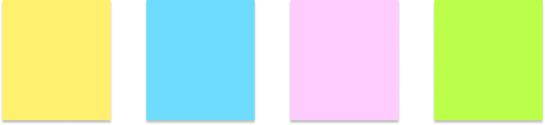

# 메모판

- ## 설명

 

자신이 적고 싶은 것을 입력하고 원하는 메모지의 색상을 선택한 후 Enter 키 또는 우측 하단 '+' 버튼을 누르면 메모판에 입력한 문자가 적힌 메모지가 붙는 메모판입니다.

--

메모지 색상은 노랑, 파랑, 분홍, 초록 총 4가지이며
한 메모지 당 글자는 최대 140자를 적을 수 있습니다.

--

메모지에 마우스를 올라면 메모지 우측 상단에 해당 메모를 삭제할 수 있는 'X' 버튼이 나타나고 'X' 버튼을 클릭하면 해당 메모가 삭제됩니다.

---

- 사용언어 : HTML, PostCSS(CSS), React(JavaScript)
